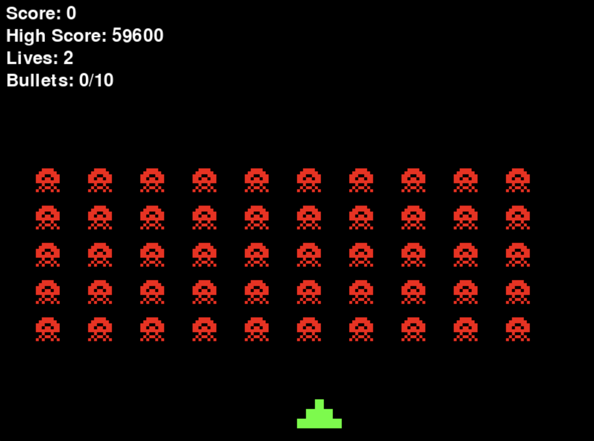

<p align="center">
  
</p>

# Space Invaders

## Description

This is a simple implementation of the classic arcade game "Space Invaders".

When playing video games, I think about solving problems in the background and train my ability to stay calm and focused to solve problems in realtime (e.g., get out of a sticky situation vs. panicing and giving up). These skills apply well to motorcycling, driving in rush hour traffic, or any urgent siutations where maintaining your composure is key. This game was created to help me concentrate on solving problems in realtime and maintain the ability to stay calm and focused even in the midst of a stressful situation.

The game has options that allow you to dial the difficulty up or down to avoid frustration so your mind can focus on other things while playing. As the game gets too easy, you can dial up the difficulty to make it more challenging, but remember, the purpose of the game is to train your ability to stay calm and focused even in the midst of a stressful situation, and not to get good at playing games.

## Project Structure

```
.
├── logo/
│   └── invaders_logo1.png     # Game logo image
├── src/
│   ├── constants.py           # Game constants and configurations
│   ├── game.py                # Main game logic and loop
│   ├── game_objects.py        # Game entities (player, aliens, bullets)
│   └── options.py             # Game options handling
├── create_assets.py           # Script to generate game assets (use only if they change)
├── game_options.json          # Stores game settings
├── high_score.json            # Stores player high scores
├── requirements.txt           # Python dependencies
├── README.md                  # Project documentation
└── space_invaders.py          # Main entry point
```

## Quick Start

```bash
# Clone the repository
git clone https://github.com/dperique/invaders.git
cd invaders

# Create and activate virtual environment
python -m venv .venv
source .venv/bin/activate   # On Windows, use: .venv\Scripts\activate

# Install dependencies
pip install -r requirements.txt

# Start playing
python space_invaders.py
```

## Controls

- Left/Right: Move the player left or right
- Space: Shoot a bullet
- P: Pause the game
- O: Open options menu
- Q: Quit game
- In options menu:
  - ↑/↓: Select option
  - ←/→: Adjust value
  - ESC: Save and exit options

## Gameplay

- The player can move left and right to avoid incoming alien bullets.
- The player can shoot bullets to destroy aliens.
- The game ends when the player is hit by an alien bullet or runs out of lives.
- The game can be paused by pressing P.
- If the game is too easy or too hard, adjust the difficulty in the options menu.
